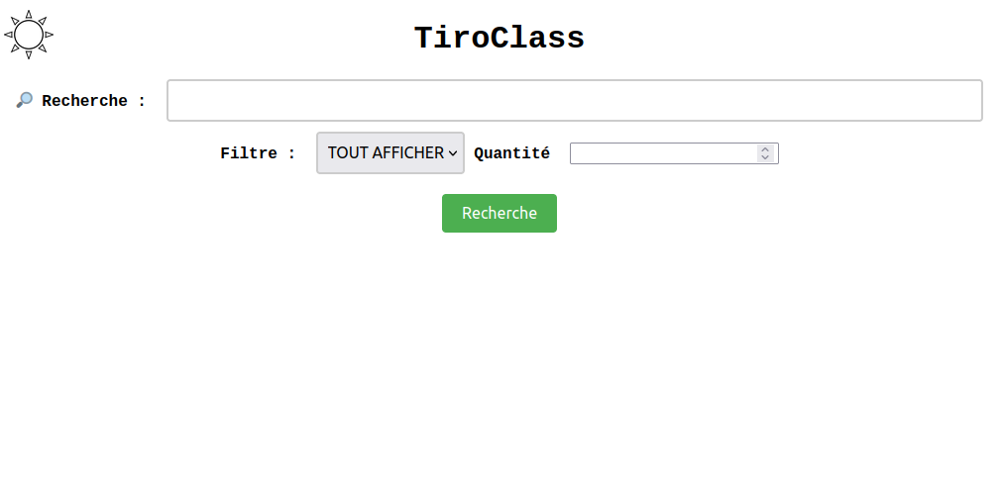
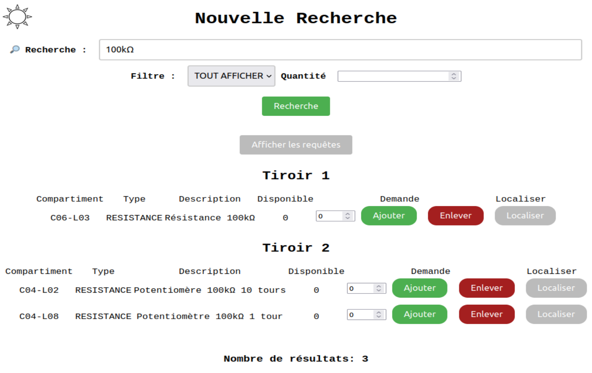

# Mini-projet Tiroclass 2023

## Description

**Tiroclass 2023** est un mini-projet permettant de rechercher de manière efficace un composant dans une servante sans se compliquer à retenir les emplacement. Suite à une recherche, le système affichera l'emplacement du tiroir à l'aide d'un bandeau LED.

L'application web est à disposition afin d'effectuer des recherches et d'indiquer le nombre de composants disponible dans la servante et d'aeffectuer une opération d'ajout ou de retrait.

## Installation

* Installer un serveur web et une base de données SQL (par exemple, [XAMPP](https://www.apachefriends.org/fr/), ...)
* Créer une base de données et les tables manuellement à partir du fichier `sql/tiroclass2023.sql`, par exemple :
    ```sql
    CREATE TABLE 'tiroir01' ('ID' varchar(100) CHARACTER SET utf8mb4 COLLATE utf8mb4_general_ci NOT NULL,
    'TYPE' varchar(100) CHARACTER SET utf8mb4 COLLATE utf8mb4_general_ci NOT NULL,
    'NAME' varchar(100) CHARACTER SET utf8mb4 COLLATE utf8mb4_general_ci NOT NULL,
    'TAGS' varchar(1000) COLLATE utf8mb4_general_ci NOT NULL,
    'QUANTITY' int NOT NULL DEFAULT '0')
    ENGINE=InnoDB DEFAULT CHARSET=utf8mb4 COLLATE=utf8mb4_general_ci;

    ...
    ```
* Ajouter le contenu de la servante dans la base de données (des exemples sont fournis  dans `sql/tiroclass2023.sql`)
* Renseigner les fichiers PHP avec les paramétres d'accès à la base de données
* Connecter une carte Arduino
* Brancher les bandeaux LED ainsi que le bouton d'arrêt sur la carte
* Téléverser le code du répertoire `arduino`
* Disposer les bandeaux LED sur la servante
* Démarrer le serveur web et se rendre à l'adresse de celui-ci

## Utilisation

Depuis l'interface web, recherchez un composant grâce à :

  * Son nom
  * Son modèle
  * Des mots clés
  * Sa quantité disponible
  * Son type



Ensuite cliquez sur "Rechercher" afin d'afficher tous les composants correspondants.



Ajouter/Enlever une certaine quantité d'un composant.

Lors d'un clic sur le bouton "Localiser", le site enverra une requête vers la carte Arduino via le port USB et le bandeau LED affichera le tiroir ainsi que l'emplacement du composant recherché.

Appuyer ensuite sur le bouton connecté à la carte pour indiquer la fin de la localisation, ce qui éteindra le bandeau LED.

## Bibliothèques

La carte Arduino du projet Tiroclass utilise la bibliothèque [FastLED](https://github.com/FastLED/FastLED) pour piloter les bandeaux Leds.

## Auteurs

- HILLON Jules
- VALOBRA Enzo
- BAUDET Jules

---
©️ LaSalle Avignon - 2023
